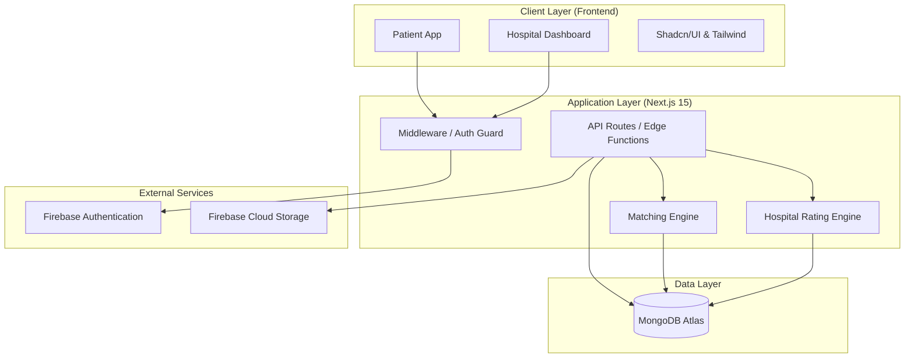

# MedDecision: System Architecture

This document provides a technical visualization of the MedDecision platform's architecture, data flows, and component interactions.

## 1. High-Level Architecture
The system follows a **Modern Decoupled Architecture** built on the Next.js App Router, combining Server-Side Rendering (SSR) for performance and Client-Side Interactivity for a premium user experience.

---

## 2. Core Components

### 2.1 The Portal Stack
- **Patient Portal**: Handles health profiling, budget constraints, and treatment discovery.
- **Hospital Portal**: Real-time management of inventories (beds, OTs), pricing modules, and media assets.

### 2.2 Intelligence Layer (Engines)
- **Hospital Rating Engine (HRE)**: A standalone logic module that processes raw hospital data into a weighted quality score.
- **Matching Engine (ME)**: A context-aware algorithm that calculates suitability by intersecting patient needs (budget/urgency) with hospital capabilities.

### 2.3 Security Architecture (RBAC)
The system uses a **Dual-Token Strategy**:
1.  **Firebase JWT**: Managed by Firebase SDK for identity verification.
2.  **Session Cookies**: Managed by Next.js Middleware to enforce Role-Based Access Control (RBAC) before a page even renders.

---

## 3. Data Flow Diagrams

### 3.1 Patient Treatment Discovery Flow
1.  **Request**: Patient submits treatment needs and budget.
2.  **Intercept**: Middleware validates user session.
3.  **Process**:
    - `api/treatment/match` fetches candidates from **MongoDB**.
    - **Matching Engine** calculates distance (Haversine) and suitablity.
    - **Rating Engine** calculates the provider's quality index.
4.  **Response**: Ranked list returned with dynamic "Fit Reasons" and Radar Charts.

### 3.2 Hospital Data Synchonization
1.  **Input**: Admin updates bed availability or uploads clinic photos.
2.  **Storage**:
    - Images/Media -> **Firebase Storage**.
    - Structured Metadata -> **MongoDB**.
3.  **Invalidation**: The Rating Engine scores are recalculated on-the-fly to ensure the Patient Portal reflects real-time status.

---

## 4. Technology Decisions Rationale

| Layer | Technology | Rationale |
| :--- | :--- | :--- |
| **Framework** | Next.js 15 | Provides the hybrid benefit of SSR for SEO/Performance and API routes for backend logic. |
| **Primary DB** | MongoDB | Document-based structure allows for flexible hospital profiles (varying specialties/pricing). |
| **Auth** | Firebase | Industry-standard security, handling complex flows like "Forgotten Password" and Social Auth out-of-the-box. |
| **Visualization** | Recharts | SVG-based rendering for high-performance interactive radar charts. |
| **Maps** | Leaflet | Lightweight alternative to Google Maps for plotting hospital coordinates without heavy API costs. |

---
*Last Updated: February 21, 2026*
